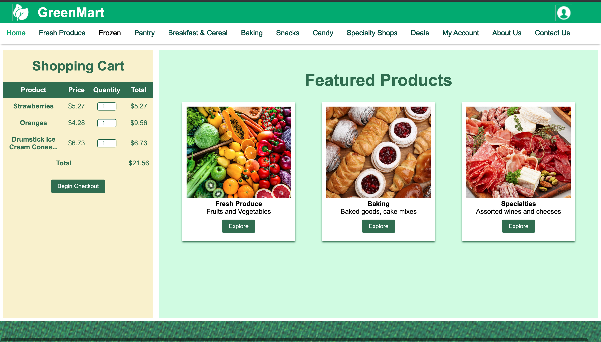
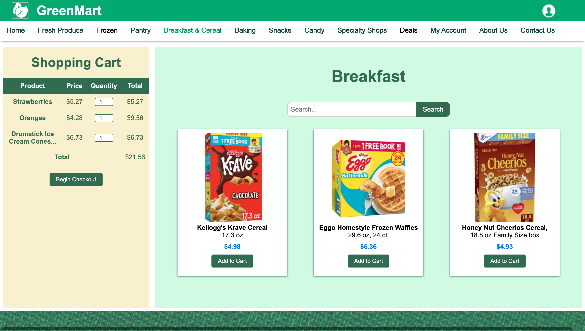

# GreenMart
# Online Grocery Store Web Application

<!--  -->

## Project Description

This project is a web application for an online grocery store, developed using HTML and CSS. The goal is to create a user-friendly interface for customers to browse and purchase groceries online.

## Key Features

- User-friendly interface for easy navigation
- Browse and search design for different grocery categories
- Product listings with images, descriptions, and prices
- Shopping cart functionality design
- Responsive design for seamless use on various devices

## Technologies Used

- HTML5
- CSS3

## Demo

[Link to live demo](https://aashritha2001.github.io/GreenMart/)

## Screenshots

## Installation

1. Clone the repository.
2. Open the `index.html` file in your preferred web browser.

